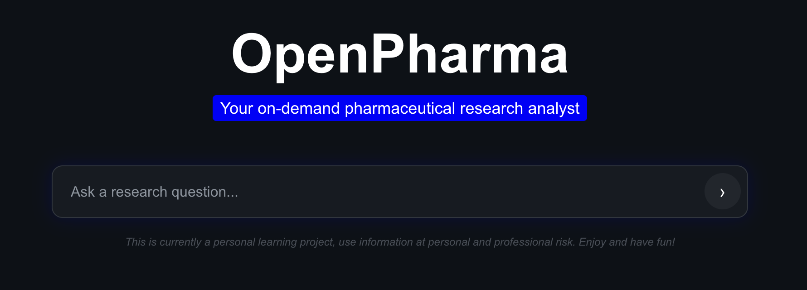
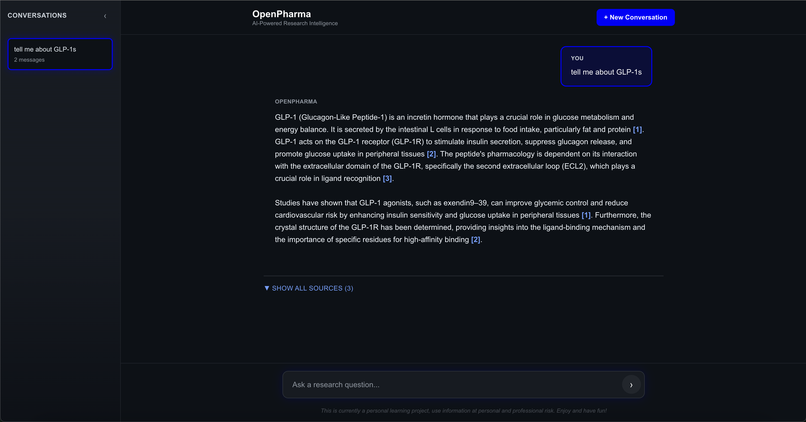
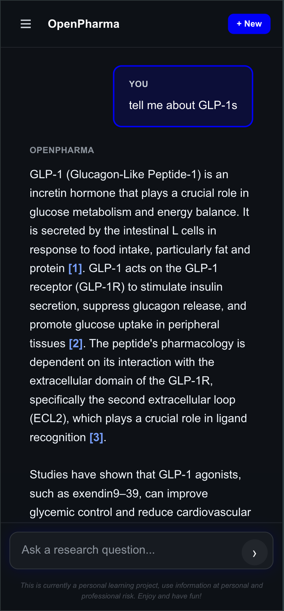

# OpenPharma

> Your on-demand pharmaceutical research analyst. Transform multi-day literature reviews into minutes. Ask natural language questions about diabetes research and get AI-synthesized answers with verifiable citations from 110K+ research papers.

## Live Demo: [openpharma.byhenry.me](https://openpharma.byhenry.me)



### Chat in Browser


### Chat on Mobile


## What It Does

Ask questions a pharma competitive intelligence analyst would ask:
- "What is the latest evidence on SGLT2 inhibitors for cardiovascular and renal protection in type 2 diabetes?"
- "How do DPP-4 inhibitors compare to sulfonylureas in efficacy and safety for newly diagnosed type 2 diabetes?"
- "What neuroprotective mechanisms have been proposed for metformin in recent studies?"

Get synthesized answers backed by verifiable citations to specific papers, sections, and passages.

## System Stats

- **110K papers** from PubMed Central (52K diabetes 2020-2025 + 58K high-impact historical)
- **4.7M semantic chunks** with 768-dimensional embeddings
- **165 GB database** including full papers and NIH citation metadata
- **<$50 total cost** via self-hosted Ollama (embeddings + LLM)

## Tech Stack

**Backend:** FastAPI, PostgreSQL + pgvector, Ollama / Claude API (configurable)
**Frontend:** Next.js 15, TypeScript, Tailwind CSS
**Evaluation:** MLFlow, PubMedQA golden dataset, automated metrics + LLM-as-judge
**Pipeline:** 4-stage ingestion (collect, fetch, chunk, embed)

## Architecture

```
User Query
    |
Semantic Search (pgvector HNSW) --> 4.7M chunks
    |
Cross-Encoder Reranking (ms-marco-MiniLM-L-6-v2)
    |
LLM Generation (Llama 3.1 8B / Claude Haiku 3)
    |
Cited Answer + Source Papers
```

## Evaluation: Llama 3.1 8B vs Claude Haiku 3

Both models evaluated on 194 expert-labeled PubMedQA questions using identical retrieval (pgvector + cross-encoder reranking). Automated metrics calculated programmatically; conclusion match, reasoning match, and faithfulness scored by LLM-as-judge (Gemini).

| Metric | Llama 3.1 8B | Claude Haiku 3 | Delta |
|---|---|---|---|
| Conclusion Match | 75.8% (147/194) | 77.8% (151/194) | +2.0% |
| Reasoning Match | 79.9% (155/194) | 80.4% (156/194) | +0.5% |
| Citation Validity | 98.2% | 91.2% | -7.0% |
| Faithfulness | 4.8/5 | 4.4/5 | -0.4 |
| Relevance | -- | 5.0/5 | -- |
| Avg Response Time | 38.6s | 6.8s | -82% |

**Key findings:**

- **Response time:** Claude Haiku is 5.7x faster (6.8s vs 38.6s), shifting the bottleneck from LLM generation to retrieval.
- **Reasoning quality:** Modest gains (+2% conclusion, +0.5% reasoning). For well-structured RAG with strong prompts, retrieval quality matters more than model size.
- **Citation discipline:** Llama 3.1 8B scores higher on citation validity (98.2% vs 91.2%) and faithfulness (4.8 vs 4.4), suggesting the smaller model is more disciplined about citing only from provided context.
- **Implication:** The RAG pipeline and prompt engineering are the primary drivers of answer quality, not the LLM. This validates investing in retrieval improvements over model upgrades.

Evaluation tracked via MLFlow with experiment comparison, prompt versioning, and artifact logging. See [docs/40_evaluation_strategy.md](docs/40_evaluation_strategy.md) for the full framework.

## Key Technical Decisions

- **Self-hosted Ollama:** Reduced embedding costs from $500+ to $0
- **NIH iCite citation filtering:** 95th percentile filter reduced 2.6M candidate papers to 58K high-impact historical papers
- **Section-aware chunking:** Preserves paper structure (abstract, methods, results) for accurate citations
- **Cross-encoder reranking:** Improves retrieval quality with minimal latency cost (~0.8s)
- **Dual LLM support:** Configurable Ollama (local, $0) or Claude API (cloud, fast) with a single environment variable

## More Info

See [docs/](docs/) for detailed design decisions, architecture, and implementation.

---

**Note:** This is a personal learning project. Not for clinical or professional use.
