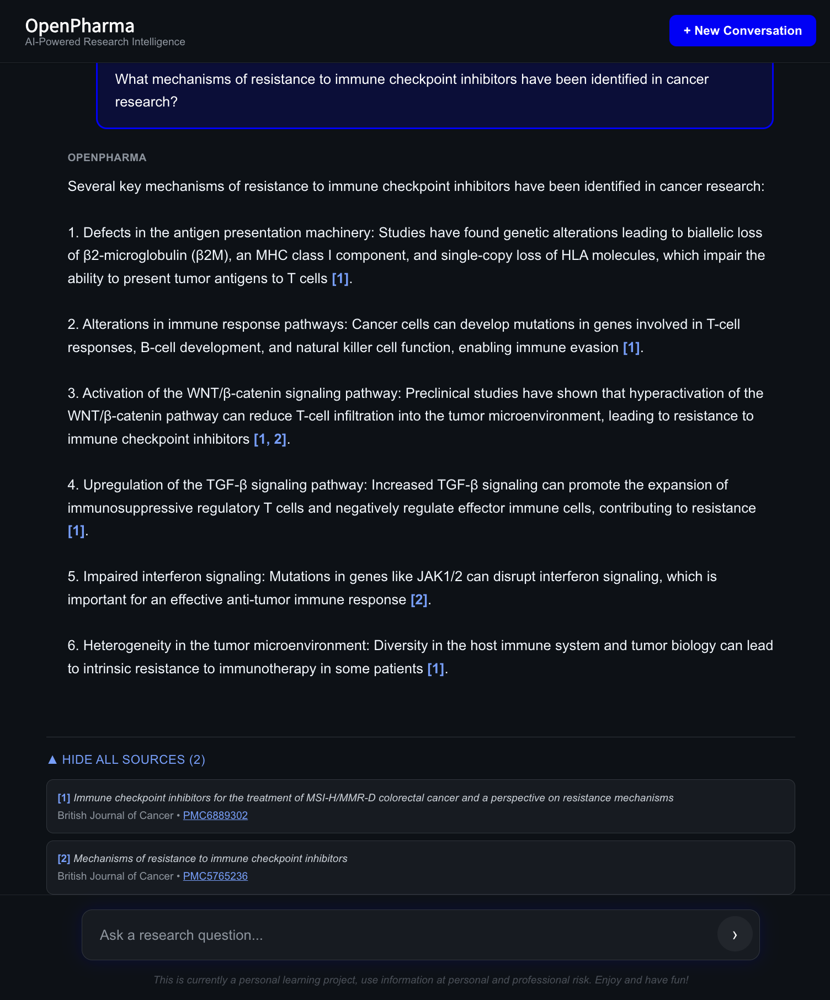

# OpenPharma

> Your on-demand research analyst. Ask natural language questions about biomedical research and get AI-synthesized answers with verifiable citations from 110K+ papers.

**Live Demo: [openpharma.byhenry.me](https://openpharma.byhenry.me)**



<details>
<summary>Mobile views</summary>

 

</details>

## What It Does

Ask questions a pharma competitive intelligence analyst would ask:
- "What mechanisms of resistance to immune checkpoint inhibitors have been identified in cancer research?"
- "What neuroprotective mechanisms have been proposed for metformin in recent studies?"
- "What are the emerging approaches to combat antimicrobial resistance?"

Get synthesized answers backed by verifiable citations to specific PubMed Central papers.

## System Stats

| | |
|---|---|
| **Papers** | 110K from PubMed Central (52K diabetes 2020-2025 + 58K high-impact historical) |
| **Chunks** | 4.7M semantic chunks with 768d embeddings |
| **LLM** | Claude Haiku 3 (default) with automatic Ollama Llama 3.1 8B fallback |
| **Embedding cost** | $0 via self-hosted Ollama nomic-embed-text |

## Tech Stack

**Backend:** FastAPI, PostgreSQL + pgvector, Claude API (default) / Ollama (fallback)
**Frontend:** Next.js 15, TypeScript, Tailwind CSS
**Evaluation:** MLFlow, PubMedQA golden dataset (194 questions), automated metrics + LLM-as-judge
**Pipeline:** 4-stage ingestion (collect, fetch, chunk, embed), self-hosted embeddings

## Architecture

```
User Query
    |
Semantic Search (pgvector HNSW) --> 4.7M chunks
    |
Cross-Encoder Reranking (ms-marco-MiniLM-L-6-v2)
    |
LLM Generation (Claude Haiku 3, Ollama fallback)
    |
Citation Extraction & Numbering
    |
Cited Answer + Linked PMC Sources
```

## Evaluation: Llama 3.1 8B vs Claude Haiku 3

Both models evaluated on 194 expert-labeled PubMedQA questions using identical retrieval (pgvector + cross-encoder reranking). Automated metrics calculated programmatically; conclusion match, reasoning match, and faithfulness scored by LLM-as-judge (Gemini).

| Metric | Llama 3.1 8B | Claude Haiku 3 | Delta |
|---|---|---|---|
| Conclusion Match | 75.8% (147/194) | 77.8% (151/194) | +2.0% |
| Reasoning Match | 79.9% (155/194) | 80.4% (156/194) | +0.5% |
| Citation Validity | 98.2% | 91.2% | -7.0% |
| Faithfulness | 4.8/5 | 4.4/5 | -0.4 |
| Relevance | -- | 5.0/5 | -- |
| Avg Response Time | 38.6s | 6.8s | -82% |

**Key findings:**

- **Response time:** Claude is 5.7x faster (6.8s vs 38.6s), shifting the bottleneck from LLM generation to retrieval.
- **Reasoning quality:** Modest gains (+2% conclusion, +0.5% reasoning). With strong retrieval and prompts, model choice matters less than pipeline quality.
- **Citation discipline:** The smaller local model scores higher on citation validity (98.2% vs 91.2%) and faithfulness (4.8 vs 4.4), staying more strictly within provided context.
- **Implication:** RAG pipeline and prompt engineering are the primary drivers of answer quality, not the LLM. This validates investing in retrieval improvements over model upgrades.

Evaluation tracked via MLFlow with experiment comparison, prompt versioning, and artifact logging. See [docs/40_evaluation_strategy.md](docs/40_evaluation_strategy.md).

## Key Design Decisions

- **Self-hosted embeddings:** Ollama nomic-embed-text reduced embedding cost from $500+ to $0 for 4.7M chunks
- **NIH iCite citation filtering:** 95th percentile filter reduced 2.6M candidate papers to 58K high-impact historical
- **Section-aware chunking:** Preserves paper structure (abstract, methods, results) for accurate citations
- **Cross-encoder reranking:** ms-marco-MiniLM improves retrieval precision with ~0.8s latency cost
- **Automatic LLM fallback:** Claude API by default, seamless fallback to local Ollama if API is unavailable
- **Anonymous sessions:** localStorage-based user sessions with conversation isolation and ownership validation

See [docs/](docs/) for detailed architecture and design decisions.

---

*Personal learning project. Not for clinical or professional use.*
